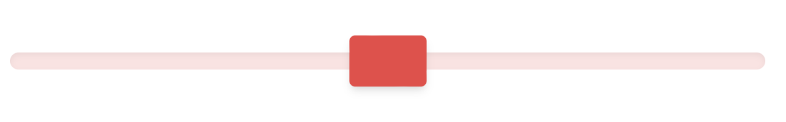

# jcaillot/tailwind-plugin-range-variant

A TailwindCSS plugin that allows styling HTML input type range (by adding a
range-thumb variant to TailwindCSS)


## Installation

Install the plugin from npm:

  ```shell
npm install -D tailwind-plugin-range-variant
```

or

```shell
yarn add -D tailwind-plugin-range-variant
```

Then add the plugin to your tailwind.config.js file:

```JavaScript

// tailwind.config.js
module.exports = {
  theme: {
    // ...
  },
  plugins: [
    require('tailwind-plugin-range-variant'),
    // ...
  ],
}

```


## Basic usage

```HTML

<input type="range" class="

              appearance-none
              
              h-3
              w-1/2
              bg-red-100
              rounded-full
              cursor-pointer
              shadow-inner

              range-thumb:appearance-none
              
              range-thumb:w-[54px]
              range-thumb:h-[36px]
              range-thumb:bg-red-400
              range-thumb:rounded
              range-thumb:shadow-md
              range-thumb:hover:bg-red-500"
/>


```

Result in Safari/Chrome/Firefox/Edge :



**Important**: TailwindCSS does not reset the browser default for the input type
range (nor for the input range thumb). Therefore you must leverage "
appearance-none" for both.

## How to run test

```shell
jest --coverage
```

## Licence

This project is licensed under the [MIT License](./LICENSE).

## Authors

- [@jcaillot](http://chaman.ca)
